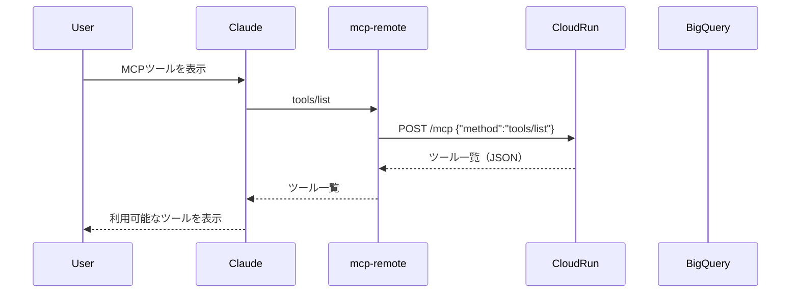
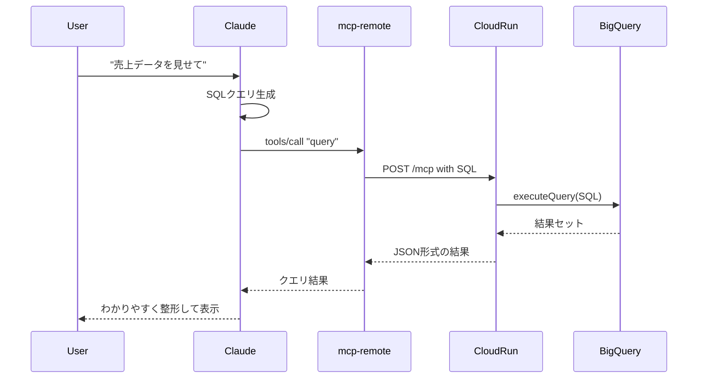
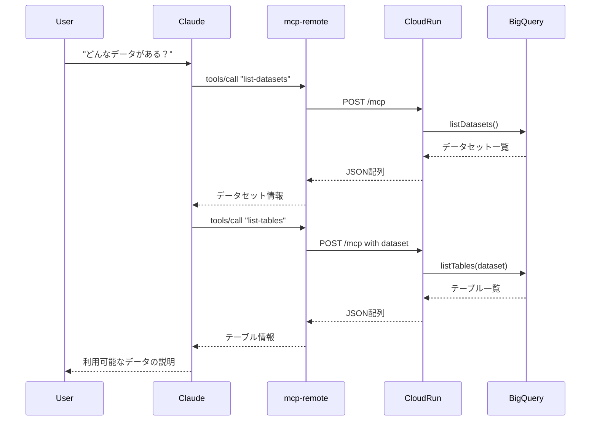

# システムアーキテクチャと処理フロー

## 概要

MCP Toolboxは、LLM（Claude Desktop等）がBigQueryと自然言語でやり取りできるようにするシステムです。Google公式のMCP Toolboxコンテナを使用し、Cloud Run上で動作します。

## システム全体図

```
┌─────────────────┐
│ Claude Desktop  │
│   (Client)      │
└────────┬────────┘
         │ MCP Protocol (JSON-RPC)
         │ + Bearer Token
         ↓
┌─────────────────┐
│   mcp-remote    │
│   (NPX Proxy)   │
└────────┬────────┘
         │ HTTPS
         ↓
┌─────────────────┐
│   Cloud Run     │
│ (MCP Toolbox)   │
└────────┬────────┘
         │ BigQuery API
         ↓
┌─────────────────┐
│    BigQuery     │
│   (Database)    │
└─────────────────┘
```

## コンポーネント詳細

### 1. Claude Desktop（クライアント）

**役割**: ユーザーインターフェース
- ユーザーが自然言語でクエリを入力
- MCPツールを通じてBigQueryにアクセス
- 結果を人間が理解しやすい形式で表示

**設定ファイル**:
```json
{
  "mcpServers": {
    "bigquery": {
      "command": "npx",
      "args": [
        "-y",
        "mcp-remote",
        "https://mcp-toolbox-bigquery-xxx.run.app/mcp",
        "--header",
        "Authorization: Bearer TOKEN"
      ]
    }
  }
}
```

### 2. mcp-remote（プロキシ）

**役割**: ローカル↔リモート間の通信橋渡し
- Claude DesktopからのMCPリクエストを受信
- HTTPSでCloud Runサービスに転送
- 認証トークンを付与

**処理フロー**:
1. Claude DesktopからJSON-RPCリクエスト受信
2. Authorization headerを追加
3. Cloud RunのMCPエンドポイントに転送
4. レスポンスをClaude Desktopに返却

### 3. Cloud Run（MCP Toolbox Server）

**役割**: MCPプロトコルの実装とBigQuery接続
- MCPツールの実装
- BigQuery APIとの通信
- 認証・認可の処理

**エンドポイント**:
- `/mcp` - MCPプロトコルエンドポイント（POST）
- `/health` - ヘルスチェック（GET）※現在は404

**環境変数**:
```bash
GCP_PROJECT_ID=trans-grid-245207
BQ_LOCATION=asia-northeast1
LOG_LEVEL=info
```

### 4. BigQuery

**役割**: データストレージと分析エンジン
- SQLクエリの実行
- データセット/テーブル情報の提供
- 分析結果の返却

## 処理フローの詳細

### フロー1: ツール一覧取得



**リクエスト例**:
```json
{
  "jsonrpc": "2.0",
  "method": "tools/list",
  "params": {},
  "id": 1
}
```

**レスポンス例**:
```json
{
  "jsonrpc": "2.0",
  "id": 1,
  "result": {
    "tools": [
      {
        "name": "query",
        "description": "Execute any SQL query on BigQuery"
      },
      {
        "name": "list-datasets",
        "description": "List all datasets"
      }
    ]
  }
}
```

### フロー2: SQLクエリ実行



**処理ステップ**:

1. **自然言語理解**
   - ユーザーの意図を理解
   - 必要なテーブル/カラムを特定

2. **SQLクエリ生成**
   - 適切なSQLクエリを構築
   - パラメータの設定

3. **クエリ実行**
   ```json
   {
     "jsonrpc": "2.0",
     "method": "tools/call",
     "params": {
       "name": "query",
       "arguments": {
         "sql": "SELECT * FROM dataset.table LIMIT 10"
       }
     },
     "id": 2
   }
   ```

4. **結果処理**
   - JSON形式でデータ受信
   - 人間が理解しやすい形式に変換

### フロー3: メタデータ取得



## 認証フロー

### 1. サービスアカウント認証（Cloud Run）

```
Cloud Run Service
    ↓
Service Account: mcp-toolbox-sa
    ↓
IAM Roles:
  - roles/bigquery.user
  - roles/bigquery.dataViewer
    ↓
BigQuery Access
```

### 2. クライアント認証（Claude Desktop）

```
Client Service Account
    ↓
Generate Access Token (1時間有効)
    ↓
Bearer Token in Header
    ↓
Cloud Run Invoker Permission
    ↓
Access to MCP Endpoint
```

## 利用可能なMCPツール

### 1. query
**目的**: SQLクエリの実行
**入力**:
- `sql` (string): 実行するSQLクエリ

**処理**:
1. SQLクエリの検証
2. BigQuery APIでクエリ実行
3. 結果をJSON形式で返却

### 2. list-datasets
**目的**: データセット一覧の取得
**入力**: なし（プロジェクトIDは環境変数から）

**処理**:
1. BigQuery APIでデータセット一覧取得
2. データセット名の配列を返却

### 3. list-tables
**目的**: テーブル一覧の取得
**入力**:
- `dataset` (string): データセット名

**処理**:
1. 指定データセット内のテーブル一覧取得
2. テーブル名の配列を返却

### 4. table-info
**目的**: テーブルメタデータの取得
**入力**:
- `dataset` (string): データセット名
- `table` (string): テーブル名

**処理**:
1. テーブルのスキーマ情報取得
2. カラム名、型、説明等を返却

## エラーハンドリング

### 認証エラー
```json
{
  "error": {
    "code": 401,
    "message": "Unauthorized: Invalid or expired token"
  }
}
```
**対処**: トークンを再生成（`client/setup.sh`）

### クエリエラー
```json
{
  "error": {
    "code": 400,
    "message": "Invalid SQL syntax"
  }
}
```
**対処**: SQLクエリの構文を修正

### 権限エラー
```json
{
  "error": {
    "code": 403,
    "message": "Permission denied on dataset"
  }
}
```
**対処**: サービスアカウントの権限を確認

## パフォーマンス最適化

### 1. Cloud Runスケーリング
- **コールドスタート対策**: 最小インスタンス数を1に設定可能
- **自動スケーリング**: 負荷に応じて最大10インスタンスまで拡張
- **同時実行数**: 1インスタンスあたり最大1000リクエスト

### 2. BigQueryクエリ最適化
- **キャッシュ活用**: 同一クエリの結果を再利用
- **パーティション**: 日付パーティションテーブルの活用
- **LIMIT句**: 必要なデータ量のみ取得

### 3. ネットワーク最適化
- **リージョン**: Cloud RunとBigQueryを同一リージョンに配置
- **圧縮**: レスポンスのgzip圧縮
- **接続プール**: BigQuery接続の再利用

## セキュリティ考慮事項

### 1. 最小権限の原則
- BigQuery: 読み取り専用権限
- Cloud Run: 認証必須
- サービスアカウント: 必要最小限のロール

### 2. ネットワークセキュリティ
- HTTPS通信のみ
- Cloud Run認証による保護
- トークンの定期更新（1時間）

### 3. データアクセス制御
- データセットレベルのアクセス制御
- 行レベルセキュリティ（必要に応じて）
- 監査ログの記録

## モニタリング

### 1. Cloud Runメトリクス
- リクエスト数
- レスポンス時間
- エラー率
- CPU/メモリ使用率

### 2. BigQueryメトリクス
- クエリ実行時間
- スキャン量
- コスト

### 3. ログ
- Cloud Runログ: アプリケーションログ
- BigQueryログ: クエリ履歴
- 監査ログ: アクセス記録